# Introduction aux patterns de conception

Un design pattern ou pattern de conception consiste en un schéma à objets qui forme une solution à un
problème connu et fréquent. Le schéma à objets est constitué par un ensemble d’objets décrits par des
classes et des relations liant les objets.

Les patterns repondent a des problemes de conception de logiciel dans le cadre de la programmation objet. Ce sont des solutions connues et eprouvees dont la conception provient de l'experience de developpeurs.
On peut dire qu'il n'y pas de theorie derriere les patterns, mais plutot une pratique.

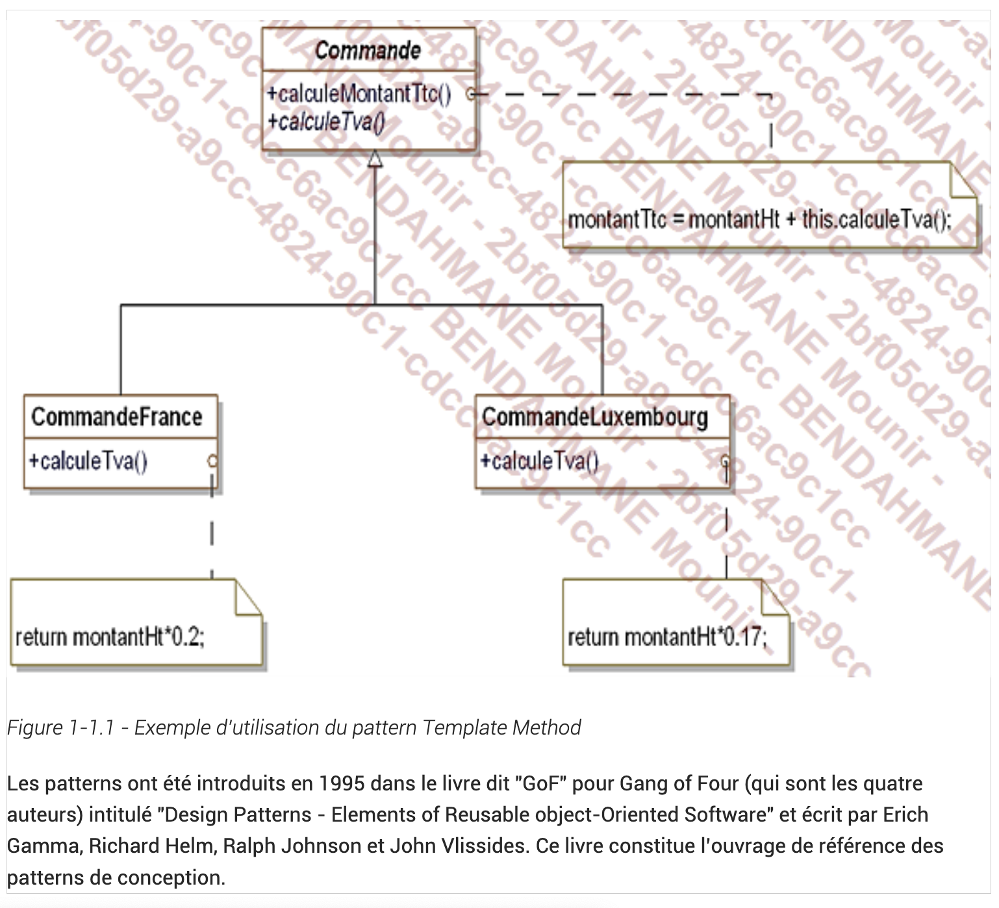

Les patterns sont basés sur les bonnes pratiques de la programmation par objets. Par exemple, la figure 1-
1.1 donne l’exemple du pattern qui sera décrit au chapitre Le pattern Template Method.Dans ce pattern, la méthode invoque la méthode qui est abstraite dans la classe . Elle est définie dans les sous-classes de à savoir les
classes et . En effet, le taux de TVA varie en fonction du
pays. Elle introduit un algorithme basé sur une méthode abstraite.

Ce pattern est basé sur le polymorphisme, une propriété importante de la programmation par objets. Le
montant d’une commande en France ou au Luxembourg est soumis à la TVA. Mais le taux n’est pas le
même, le calcul de TVA est donc différent en France et au Luxembourg. Par conséquent, le pattern
constitue une bonne illustration du polymorphisme.Template method

## La description des patterns

Dans ce cours nous avons choisi de decrire les patterns de la maniere suivante:

- le langage UML
- le langage C#

Pour chaque pattern nous presentons :

- Nom
- description
- exmemple sous forme de diagramme UML
- structure generique du pattern
- les cas d'utilisation
- un exemple de code en C#

## Liste des patterns de conception

- [Abstract Factory](abstract_factory.md): a pour objectif la creation d'une famille d'objets sans devoir preciser leur classe concrete.
- [Builder](builder.md): permet de separer la construction d'objets complexes de leur implementation de maniere a ce qu'un **client** puisser creer des objets complexes sans avoir a se soucier de leur implementation.
- [Factory Method](factory_method.md)
- [Prototype](prototype.md)
- [Singleton](singleton.md)
- [Adapter](adapter.md)
- [Bridge](bridge.md)
- [Composite](composite.md)
- [Decorator](decorator.md)
- [Facade](facade.md)
- [Flyweight](flyweight.md)
- [Proxy](proxy.md)
- [Chain of Responsibility](chain_of_responsibility.md)
- [Command](command.md)
- [Interpreter](interpreter.md)
- [Iterator](iterator.md)
- [Mediator](mediator.md)
- [Memento](memento.md)
- [Observer](observer.md)
- [State](state.md)
- [Strategy](strategy.md)
- [Template Method](template_method.md)
- [Visitor](visitor.md)

## Comment choisir et utiliser un pattern correctement ?

Voici la representation abstraite d'un pattern de conception:

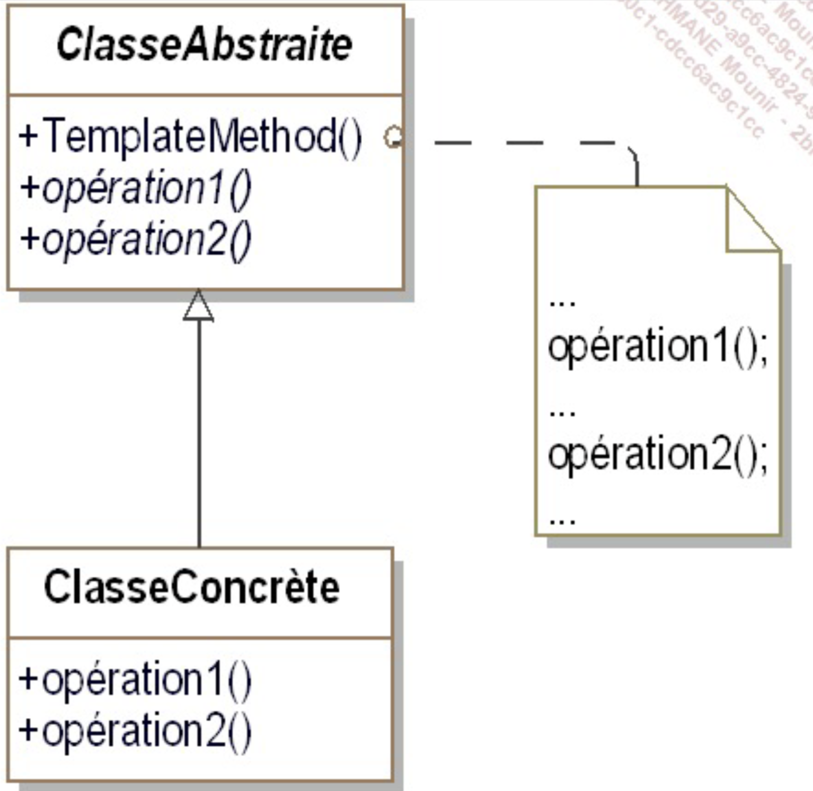

# Organisation du cours :

Les patterns de conceptions sont organisees en 3 categories:

- **Pattern de creation** : Ces patterns fournissent des mecanismes de creation d'objets qui augmentent la flexibilite et la reutilisabilite du code existant.
- **Structural patterns** : Ces patterns expliquent comment creer des structures de classes et d'objets plus complexes a partir de structures simples.
- **Behavioral patterns** : Ces patterns s'occupent de l'interaction flexible et de la distribution des responsabilites entre les objets.

# Contexte du cours

Nous allons nous placer dans le contexte d'un site web de ventes/locations de vehicules en ligne (voitures, motos, velos, etc...).

CDC :

Le site permet d’afficher un catalogue de véhicules proposés à la vente, d’effectuer des recherches au sein de ce catalogue, de passer commande d’un véhicule, de choisir des options pour celui-ci avec un système
de chariot virtuel. Les options incompatibles entre elles doivent également être gérées (par exemple "sièges sportifs" et "sièges en cuir" sont des options incompatibles). Il est également possible de revenir à
un état précédent du chariot.
Le système doit gérer les commandes. Il doit être capable de calculer les taxes en fonction du pays de
livraison du véhicule. Il doit également gérer les commandes payées au comptant et celles assorties d’une demande de crédit. Il prend en compte les demandes de crédit. Le système gère les états de la
commande : en cours, validée et livrée.
Lors de la commande d’un véhicule, le système construit la liasse des documents nécessaires comme la demande d’immatriculation, le certificat de cession et le bon de commande. Ces documents sont disponibles au format PDF ou au format HTML.
Le système permet également de solder les véhicules difficiles à vendre, à savoir ceux qui sont dans le stock depuis longtemps.
Il permet également une gestion des clients, en particulier des sociétés possédant des filiales afin de leur proposer, par exemple, l’achat d’une flotte de véhicules.
Lors de la visualisation du catalogue, il est possible de visualiser des animations associées à un véhicule.
Le catalogue peut être présenté avec un ou trois véhicules par ligne.
La recherche dans le catalogue peut s’effectuer à l’aide de mots clés et d’opérateurs logiques (et, ou).
Il est possible d’accéder au système via une interface web.

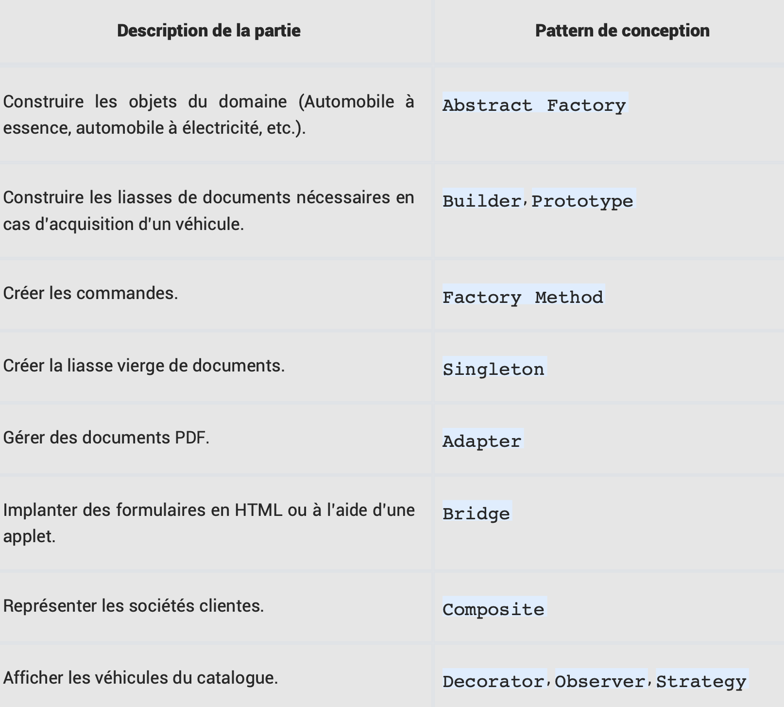

## Les patterns/patrons de creation/construction

Les patterns de creation sont des patterns qui fournissent des mecanismes de creation d'objets qui augmentent la flexibilite et la reutilisabilite du code existant : on utilise l'abstraction du mecanisme de creation d'objets.

Les classes concretes sont encapsulees lors de l'utilisation de tels patterns, on favorise l'utilisation d'intefaces et de classes abstraites.

Le pattern Singleton est un pattern de creation. il permet de construire une classe possedant au maximum une seule instance. Le mecanisme qui gere l'acces a la classe est encapsule dans la classe elle-meme. Le client de la classe n'est pas au courant de l'existence du mecanisme.

## Les problemes liés à la creation d'objets

En C# la création d'objet se fait de la facon suivante :

```C#
objet = new Classe();
```

On peut parametrer la creation d'objet en utilisant des constructeurs, ou des methodes de creation.

```java
public Document construitDocument(string typeDocument)
{
    Document document = null;
    if (typeDocument.equals("PDF"))
    {
        document = new DocumentPDF();
    }
    else if (typeDocument.equals("HTML")
    {
        document = new DocumentHTML();
    }
    return document;
}
```

Cet exemple temoigne de la complexite du parametrage du mecanisme de creation d'objet. Il est difficile de modifier le code pour ajouter un nouveau type de document.

## Les patterns de creation

### Abstract Factory

#### Definition:
Fournit une interface pour la creation de familles d'objets lies ou dependants sans preciser leur classe concrete.

#### Contexte:

Le systeme de vente de vehicules gere des vehicules qui fonctionnent soit de maniere electrique soit avec de l'essence. La gestion de ce mecanisme sera gere par la l'objet `Catalogue`. L'objet `Catalogue` se charge alors de cree de tels objets (vehicules).

Pour chacun des prduits, nous disposons d'une **classe abstraite**, et sous-classe qui decrit la version electrique et la version essence.

Si l'objet `Catalogue` utilise les sous classes pour instancier les produits, on devra apporter des modifications a la classe catalogue lors de l'ajout de chaque nouveau produit.

Le pattern **Abstract Factory** resout cette problematique en introduisant une interface `FabriqueVehicule` qui contient la signature des methodes pour definir chaque produit. Le type de retour de ces methodes est constitué par l'une des classes abstraites de produit. L'objet Catalogue n'a alors pas besoin de connaitre les classes concretes des produits.

Une sous-classe d’implementation de `FabriqueVehicule` est introduite pour chaque famille de produit, à savoir les sous-classes `FabriqueVehiculeEssence` et `FabriqueVehiculeElectrique`.
Une telle sous-classe implante les opérations de création du véhicule appropriée pour la famille à laquelle
elle est associée.

L’objet prend alors pour paramètre une instance répondant à l’interface, c’est-à-dire soit une instance de `FabriqueVehiculeElectrique` , soit une
instance de `FabriqueVehiculeEssence` . Avec une telle instance, le `Catalogue` peut créer et manipuler des véhicules sans devoir connaître les familles de véhicule et les classes concrètes
d’instanciation correspondantes.

#### Schema UML:

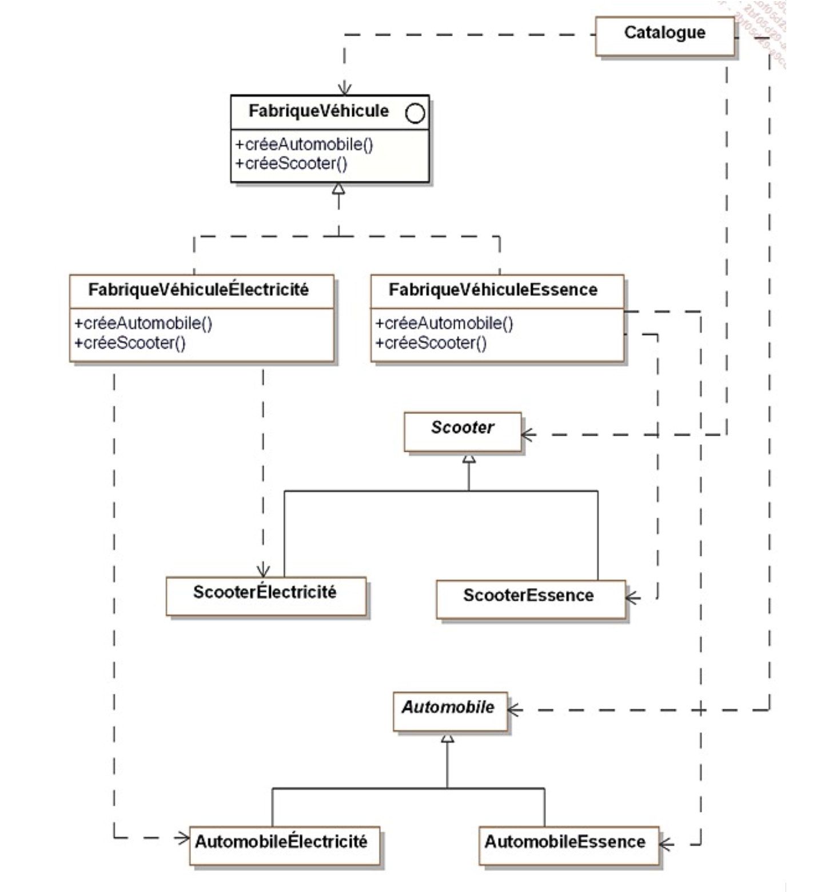

#### Structure generique du pattern:

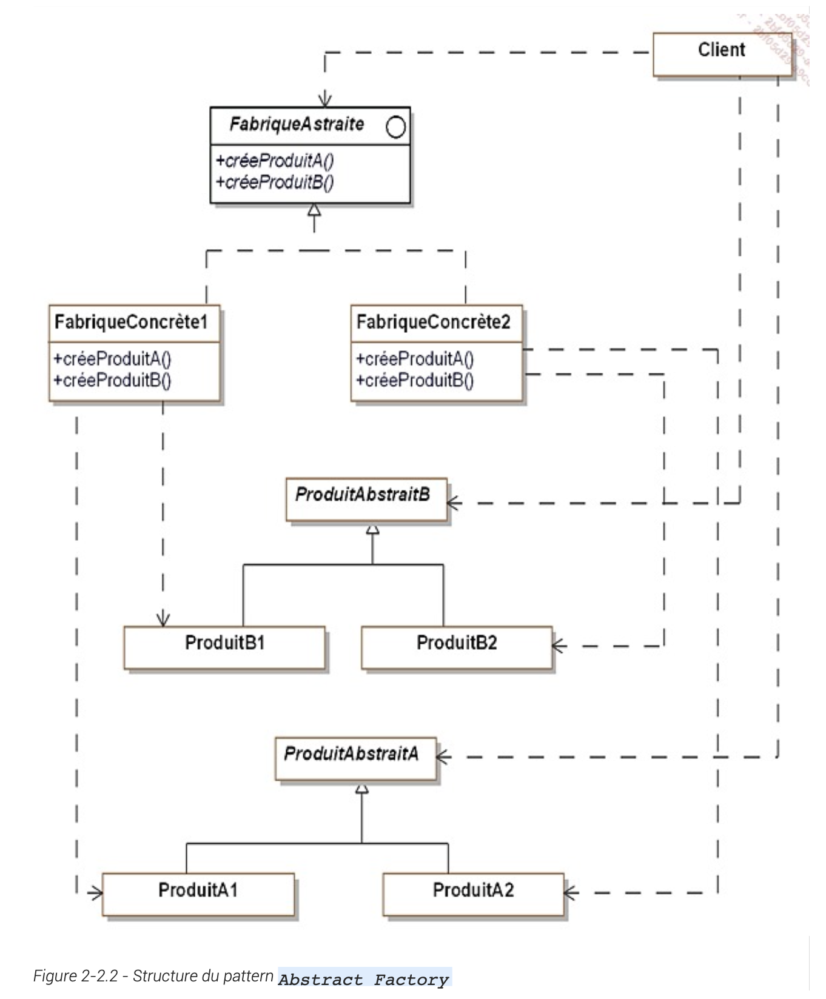

### Builder

#### Definition:

Le but est de separer la construction d'objets complexes de leur implementation de sorte qu'un client puisse creer ces objets sans avoir a se soucier de leur implementation.

#### Contexte:

Au moment de l'achat de vehicule, un commercial va creer une liasse de documents (bon de commande, demande d'immatriculation, certificat de cession, etc...). Ces documents sont disponibles au format PDF ou HTML selon le choix du client. Dans le premier , le client fournit une instance de la classe ConstructeurLiasseVehiculeHtml et dans le second cas, il fournit une instance de la classe ConstructeurLiasseVehiculePdf.
Dans un second temps le commercial effectue la demande de creation de chaque document de la liasse liee a l'instance.

Le vendeur cree alors les documents de la liasse a l'aide des methodes construitBonDeCommande et construitDemandeImmatriculation.

L'ensemble des classes du pattern Builder sont decrites ci-dessous:

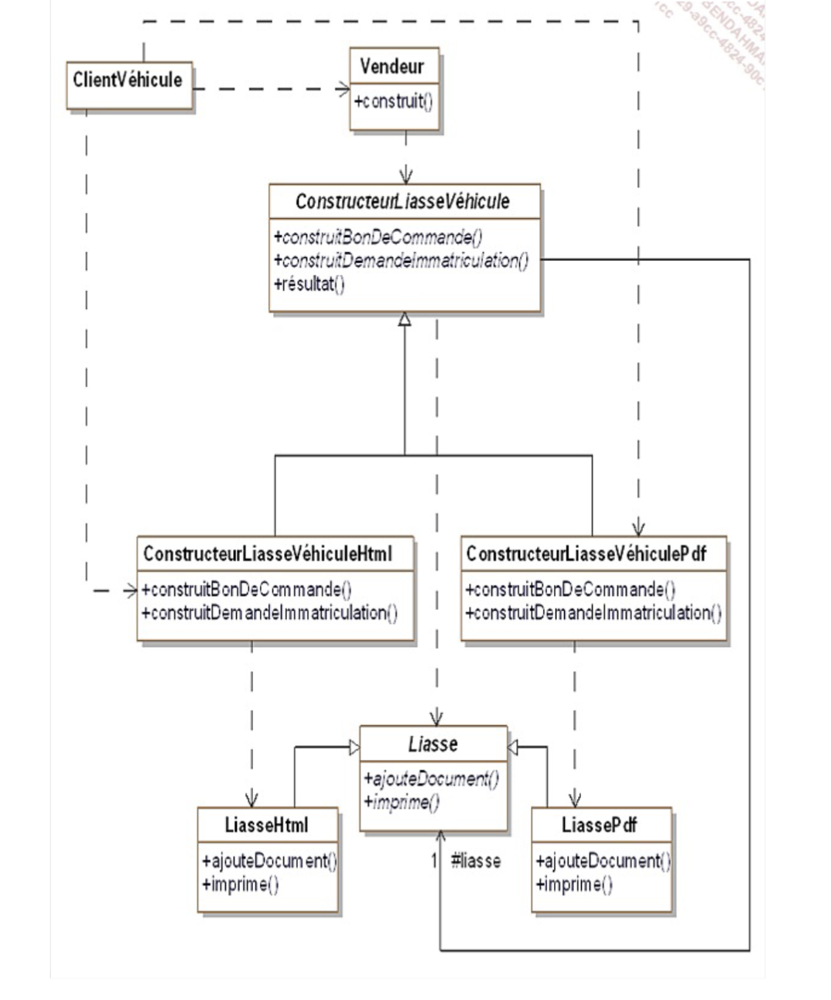

#### Schema Abstrait:

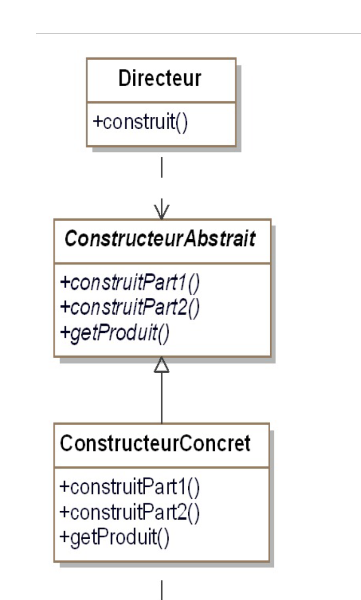

#### Diagramme de sequence:

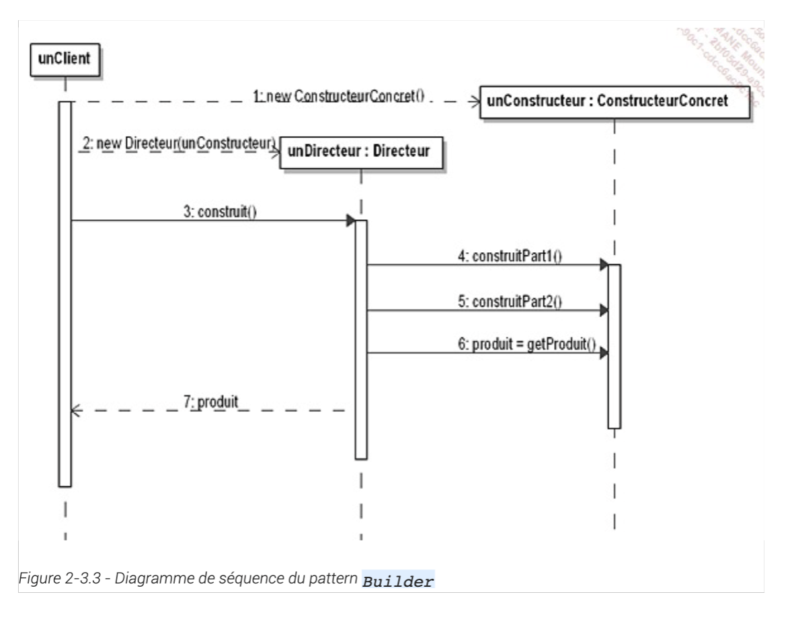

#### Domaines d'application:

Le pattern est utilise dans les cas suivants:

- Un client a besoin de construire des objets complexes sans avoir a se soucier de leur implementation.
- Un client a besoin de construire des objets complexes ayant des representations differentes.

### Factory Method

### Prototype

Definition: Le but de ce pattern est de permettre la creation d'objets en dupliquant des objets existants appeles prototypes qui sont des objets pre-construits.

Contexte:
Dans le cadre de la vente de vehicule, on genere toujours une liasse de documents. On retrouve toujours les memes documents dans la liasse.

Nous allons creer une classe `Liasse` qui contient une liste de documents vierges. Chaque instance sont des liasses qui contiennent des documents differents. Pour chaque on peut creer une ou plusieurs classes correpondantes.

#### Apercu du code:

```java
using System.Collections;
public abstract class LiasseVierge
{
    public IList<Document> documents {get; protected set;}

    public
}
```

#### Diagramme UML:

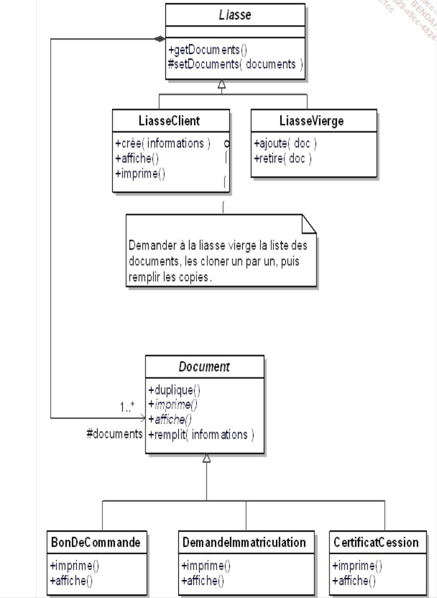

#### Singleton :

Definition: Le but de ce pattern est de garantir qu'une classe n'a qu'une seule instance et de fournir un point d'acces global a cette instance.

En se basant sur le diagramme UML du pattern précédent, créez une classe Liasse vierge qui illustre l'utilisation du pattern Singleton. Voici le diagramme general du pattern Singleton:

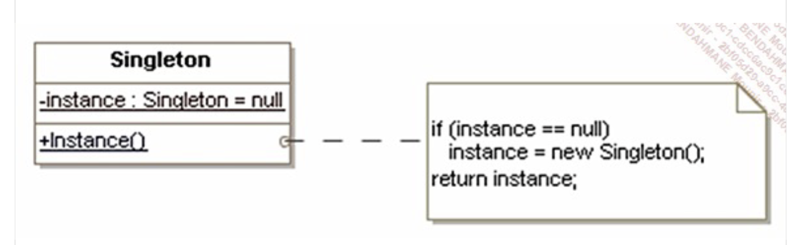

## Les patterns de structure

L'objectif des patterns de structure est de fournir des mecanismes de composition de classes et d'objets pour former des structures plus complexes. On cherche a faciliter l'independancde de l'interface d'un objet et de son implementation.

Les patterns de structuration vont venir encapsuler la composition des objets. On va ainsi augmenter le niveau d'abstraction du systeme, tout comme les patterns de creation qui encapsulent la creation d'instance d'objets.
Les patterns de structuration vont mettre en avant les interfaces.

Au sein des patterns de structuration, on retrouve les patterns suivants:

- **Adpater**: Permet d'adapter une interface existante a une autre interface attendue par le client.
- **Bridge**: Permet de separer l'implementation d'une classe de son interface.
- **Composite**: Permet de traiter des objets composes et individuels de la meme maniere.
- **Decorator**: Permet d'ajouter des fonctionnalites a un objet de maniere dynamique.
- **Facade**: Permet de creer une interface unique pour un sous-systeme.
- **Flyweight**: Permet de reduire l'utilisation de la memoire en partageant les objets qui sont identiques.
- **Proxy**: Permet de creer un objet qui agit comme un representant d'un autre objet.

### Le pattern Adapter

#### Definition:

Le but de ce pattern et de convertir l'interface d'une classe existante afin qu'elle puisse interagir avec d'autres classes.

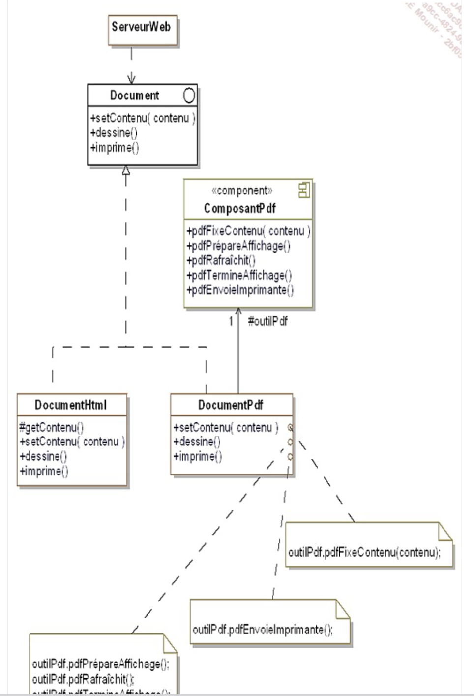

A l'aide du code source creer le diagramme UML du pattern Adapter.

Les participants du pattern a inculre sont les suivants :

- Interface: introduit les signatures de la classe Document
- Client: interagit uniquement avec des objets dont l'interface est Document
- L'adaptateur: implemente les methodes de l'interface Document et contient une instance de la classe adaptee (DocumentPdf)
- L'adapté: presente l'objet dont l'interface doit etre adapteed (ComposantPdf)

Solution:

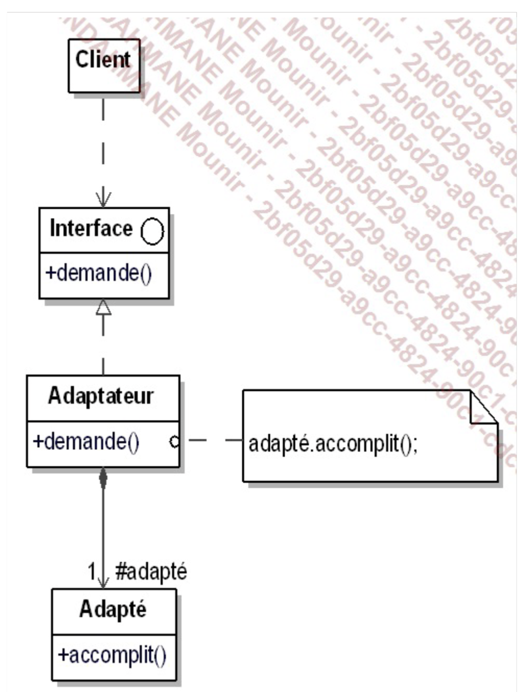

#### Cas d'utilisation:

- Un client a besoin d'utiliser une classe qui possede une interface incompatible avec celle dont il a besoin.
- On peut fournir des interfaces differentes a un objet au moment de sa conception

### Le pattern Bridge (Pont)

#### Definition:
Ce pattern va nous permettre de separer l'implementation d'une classe de son interface. Il permet de creer une interface independante de l'implementation des classes.

#### Contexte:
On souhaite effectuer une demande d'immatriculation pour un vehicule. Il existe deux types de forumalaires : applet et html. On souhaite pouvoir utiliser l'un ou l'autre en fonction du client.
Les demandes d'immatriculation provienne de deux pays differents : la France et le Luxembourg. On souhaite pouvoir utiliser l'un ou l'autre en fonction du client.

Voici typiquement le type de diagramme qu'on aurait pu obtenir si on avait introduit une nouvelle sous-classe à chaque nouveau pays ajouté au systeme:
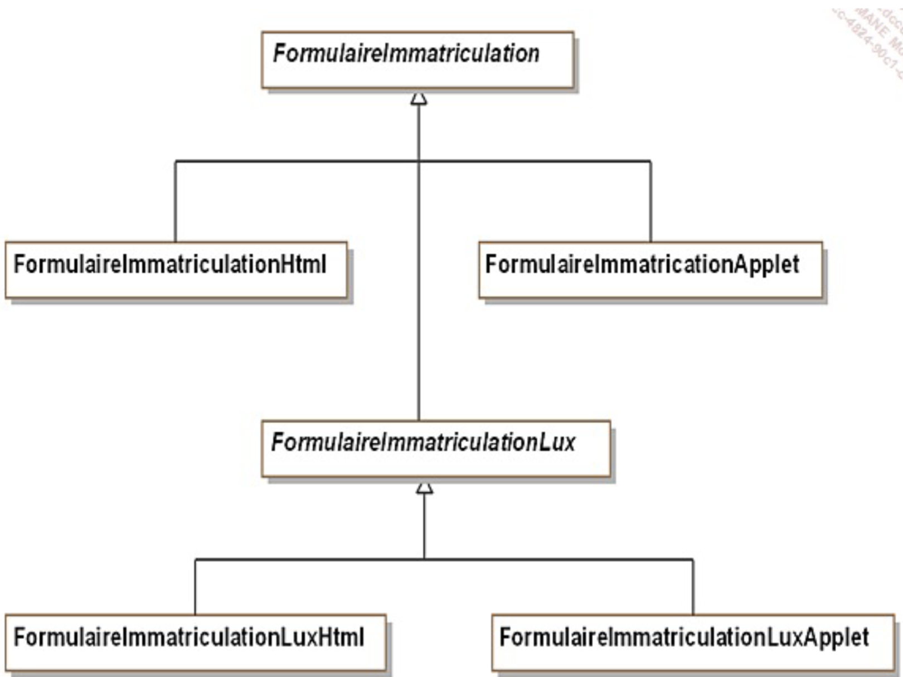

#### Structure generique du pattern

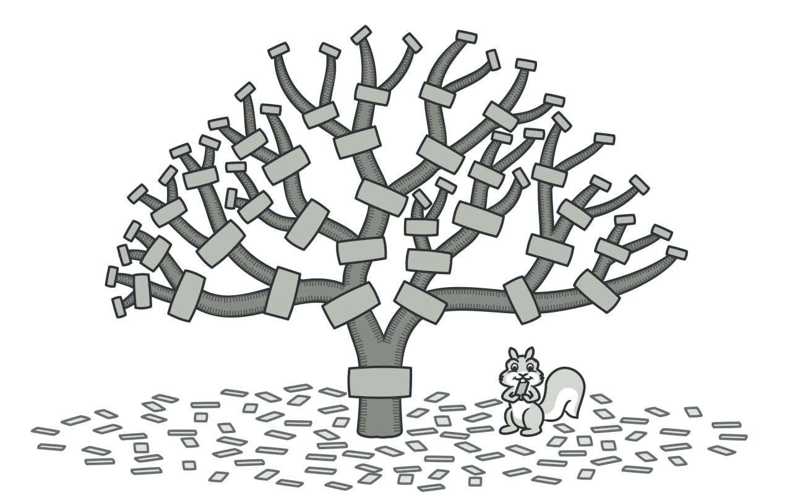
