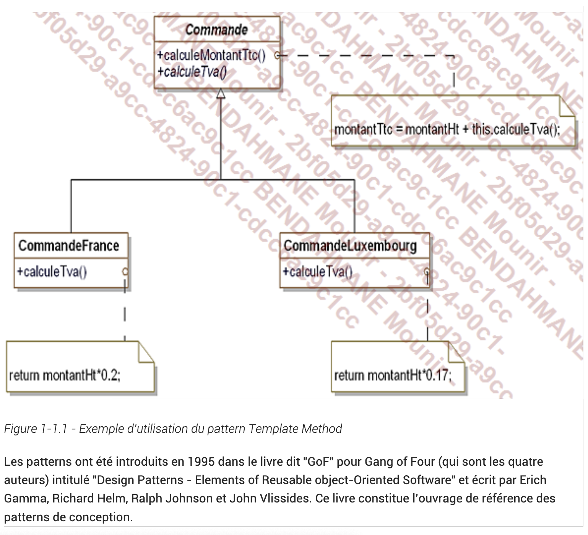

# Introduction aux patterns de conception

Un design pattern ou pattern de conception consiste en un schéma à objets qui forme une solution à un
problème connu et fréquent. Le schéma à objets est constitué par un ensemble d’objets décrits par des
classes et des relations liant les objets.

Les patterns repondent a des problemes de conception de logiciel dans le cadre de la programmation objet. Ce sont des solutions connues et eprouvees dont la conception provient de l'experience de developpeurs.
On peut dire qu'il n'y pas de theorie derriere les patterns, mais plutot une pratique.

Les patterns sont basés sur les bonnes pratiques de la programmation par objets. Par exemple, la figure 1-
1.1 donne l’exemple du pattern qui sera décrit au chapitre Le pattern Template Method.Dans ce pattern, la méthode invoque la méthode qui est abstraite dans la classe . Elle est définie dans les sous-classes de à savoir les
classes et . En effet, le taux de TVA varie en fonction du
pays. Elle introduit un algorithme basé sur une méthode abstraite.

Ce pattern est basé sur le polymorphisme, une propriété importante de la programmation par objets. Le
montant d’une commande en France ou au Luxembourg est soumis à la TVA. Mais le taux n’est pas le
même, le calcul de TVA est donc différent en France et au Luxembourg. Par conséquent, le pattern
constitue une bonne illustration du polymorphisme.Template method

## La description des patterns

Dans ce cours nous avons choisi de decrire les patterns de la maniere suivante:

- le langage UML
- le langage C#

Pour chaque pattern nous presentons :

- Nom
- description
- exmemple sous forme de diagramme UML
- structure generique du pattern
- les cas d'utilisation
- un exemple de code en C#

## Liste des patterns de conception

- [Abstract Factory](abstract_factory.md): a pour objectif la creation d'une famille d'objets sans devoir preciser leur classe concrete.
- [Builder](builder.md): permet de separer la construction d'objets complexes de leur implementation de maniere a ce qu'un **client** puisser creer des objets complexes sans avoir a se soucier de leur implementation.
- [Factory Method](factory_method.md)
- [Prototype](prototype.md)
- [Singleton](singleton.md)
- [Adapter](adapter.md)
- [Bridge](bridge.md)
- [Composite](composite.md)
- [Decorator](decorator.md)
- [Facade](facade.md)
- [Flyweight](flyweight.md)
- [Proxy](proxy.md)
- [Chain of Responsibility](chain_of_responsibility.md)
- [Command](command.md)
- [Interpreter](interpreter.md)
- [Iterator](iterator.md)
- [Mediator](mediator.md)
- [Memento](memento.md)
- [Observer](observer.md)
- [State](state.md)
- [Strategy](strategy.md)
- [Template Method](template_method.md)
- [Visitor](visitor.md)
